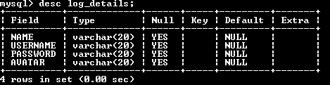
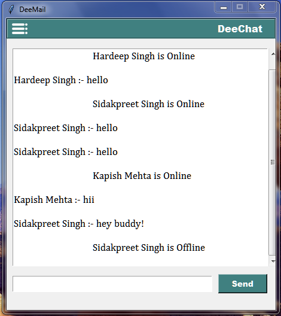
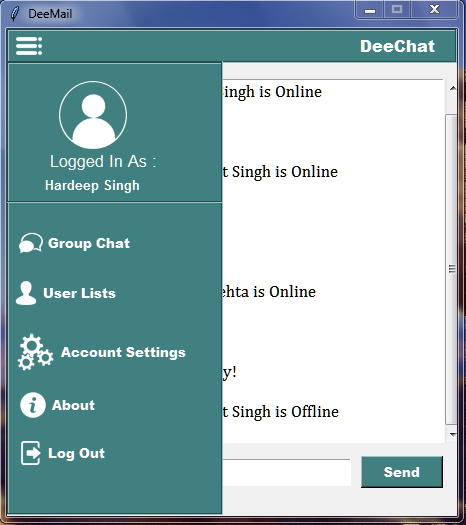
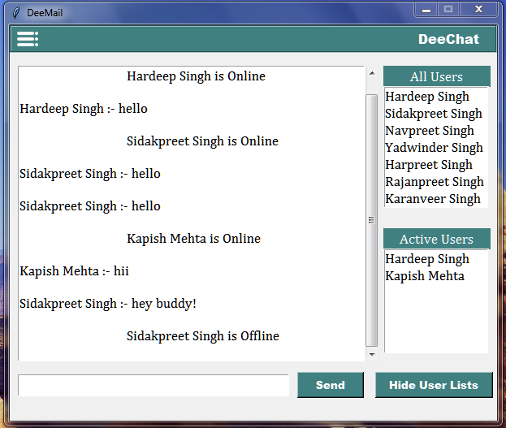
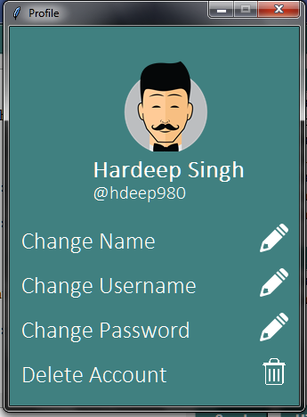

## DeeChat

## Summary :-

This is an exclusive distribution of DeeChat created By Hardeep Singh. This application was designed to have group chats. This has features like sending messages, showing all users in database, showing all the active users, working in real-time, responsive, managing account settings, login, logout, register. Hope you like the application. Please share your feedbacks.

## Requirements :- 

1. Python 3.6 or above

2. Socket module

3. Tkinter module

4. mysql.connector --> pip install mysql-connector-python

## How to Use :-

1. Run the Server File.

2. Create a database in mysql. Run the queries given below.

	i). CREATE DATABASE LOGIN_APP;
 
	ii). CREATE TABLE LOG_DETAILS(NAME VARCHAR(20), USERNAME VARCHAR(20), PASSWORD VARCHAR(20), AVATAR VARCHAR(20));
 
	iii). DESC LOG_DETAILS;
 
	iv). Output should look like :- 
 
	
	

3. Copy the repositiory in different computers or folders and run the run.py file and register with a new user.

4. Enjoy Chatting.

## Screenshots :- 

 

 

